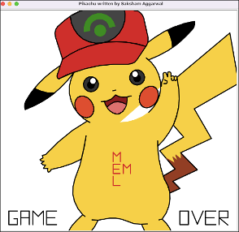

# Pokemon Top Trumps

Pokemon Top Trumps is based on the well-known top trumps game where 2 players battle against each other, and the player with the highest stat wins.

The player is initially asked how many rounds they would like to play.

The player is then asked if they would like to go first. If the player selects No, the computer (Trainer Red) will automatically select a stat at random such as Defence.

If the player decides to go first, they are then asked to select a stat from the following:

- id
- height
- weight
- base experience
- health
- attack
- defence
- special attack
- special defence
- speed 

Whoever wins scores a point. If it's a draw, both players score a point.

At the end of the game, the total score is displayed. 

The player is then asked if they would like to play again.

As soon as the player stops the game, the player is presented with the Turtle image below: 

High scores are then saved to a high_scores file and the player is asked if they would like to reset the high scores.

## PokeAPI
https://pokeapi.co/api/v2/pokemon/{pokemon_id}
